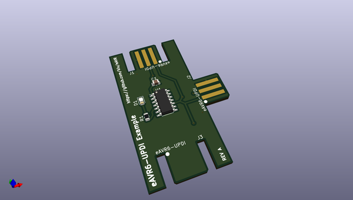
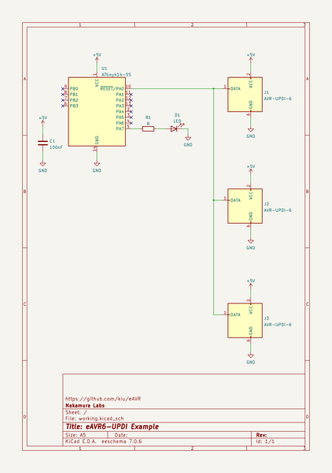

# OOMP Project  
## eAVR  by kiu  
  
(snippet of original readme)  
  
  
  
- eAVR  
  
eAVR (**e**dge AVR) replaces the standard 6P (2x03) pinheader or 6P (2x03) IDC socket for AVR device programming and debugging (aWire, PDI, SPI, TPI, UPDI) with an edge connector, reducing your BOM costs and soldering efforts.  
  
Besides the card edge footprints this project includes adapter boards to interface the standard AVR 6P connector to the required card egde connectors.  
  
-- Content  
  
This repository features footprints, adapters and example boards.  
  
* [eAVR.pretty](https://github.com/kiu/eAVR/tree/main/eAVR.pretty): Footprints for KiCad   
* [eAVR6-adapter-hrz](https://github.com/kiu/eAVR/tree/main/eAVR6-adapter-hrz): A card edge to 6pin horizontal adapter   
* [eAVR6-adapter-vrt](https://github.com/kiu/eAVR/tree/main/eAVR6-adapter-vrt): A card edge to 6pin vertical adapter  
* [eAVR6-example](https://github.com/kiu/eAVR/tree/main/eAVR6-example): An example board using TPI   
* [eAVR6-UPDI-adapter](https://github.com/kiu/eAVR/tree/main/eAVR6-UPDI-adapter): A card edge to 6pin adapter for UDPI only  
* [eAVR6-UPDI-example](https://github.com/kiu/eAVR/tree/main/eAVR6-UPDI-example): An example board using UPDI  
  
-- Disclaimer  
  
This is NOT an official standard or related to anything official by Microchip Technology Incorporated. This is a hobby standardization attempt to improve the quality of life for AVR developers.  
  
--  Wear and tear  
  
Be aware that with "cheap" PCB fabrication, your edge con  
  full source readme at [readme_src.md](readme_src.md)  
  
source repo at: [https://github.com/kiu/eAVR](https://github.com/kiu/eAVR)  
## Board  
  
  
## Schematic  
  
  
  
[schematic pdf](working_schematic.pdf)  
## Images  
