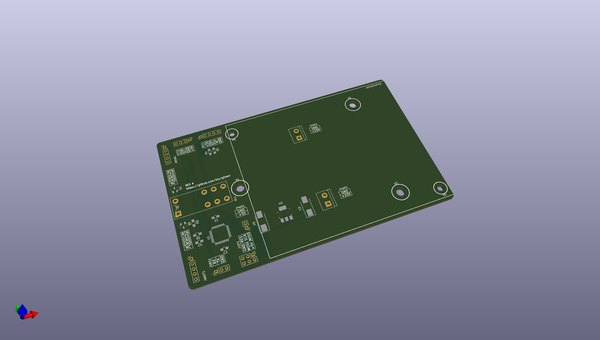
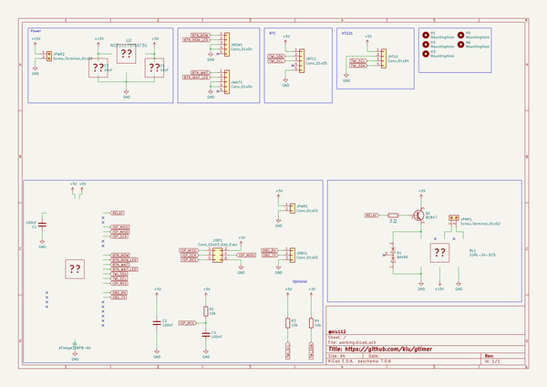

# OOMP Project  
## gtimer  by kiu  
  
oomp key: oomp_projects_flat_kiu_gtimer  
(snippet of original readme)  
  
- gtimer  
gtimer is a programmable controller for the GARDENA [Fully Automatic Flower Box Watering](https://www.gardena.com/int/products/watering/holiday-watering/fully-automatic-flower-box-watering/900916701/) drip system.  
Thanks to an ATMEGA microcontroller and a RTC module very flexible watering plans can be achieved. In addition a temperature module influences the timings based on ambient temperature during the course of the day.  
  
  
  
gtimer is a drop-in replacement for the GARDENA timer connecting to the original pump of the system.  
  
- Warning  
Be aware of what you are doing. You are playing with water and mains voltage in an outdoor environment.  
Not only might this kill you, it will hurt the whole time you're dying.  
  
- Nitty-Gritty Details  
Checkout the [pics](https://github.com/kiu/gtimer/tree/master/pics) and [hardware](https://github.com/kiu/gtimer/tree/master/hardware) section including BOM, Schematic, PCB layout, firmware, etc.  
  
  
  
  full source readme at [readme_src.md](readme_src.md)  
  
source repo at: [https://github.com/kiu/gtimer](https://github.com/kiu/gtimer)  
## Board  
  
  
## Schematic  
  
  
  
[schematic pdf](working_schematic.pdf)  
## Images  
