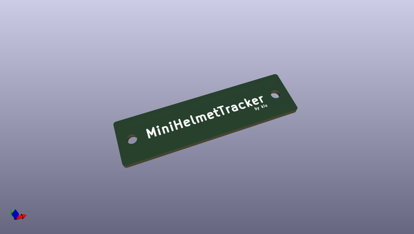

# OOMP Project  
## MiniHelmetTracker  by kiu  
  
(snippet of original readme)  
  
- MiniHelmetTracker  
  
*MiniHelmetTracker* is a real-time standings table robot.  
  
  
   
*MiniHelmetTracker* retrieves standings data - close to real-time - via WiFi and sorts [mini helmets](https://www.amazon.de/Riddell-8056173-NFL-32-teiliges-Helm-Tracker-Set/dp/B088W86SX4/) by league, conference, division or playoffs. A physical representation of the well known standings tables from [NFL](https://www.espn.com/nfl/standings) or [ESPN](https://www.espn.com/nfl/standings).  
  
Checkout the [full story](https://schoar.de/tinkering/MiniHelmetTracker) or explore this repository including STL files, schematics, PCB layouts, firmware, server, etc.  
  
- Youtube  
  
  
  
  
  
  full source readme at [readme_src.md](readme_src.md)  
  
source repo at: [https://github.com/kiu/MiniHelmetTracker](https://github.com/kiu/MiniHelmetTracker)  
## Board  
  
  
## Schematic  
  
  
  
[schematic pdf](working_schematic.pdf)  
## Images  
