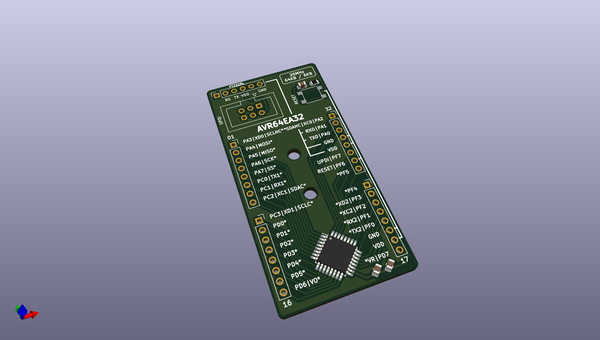
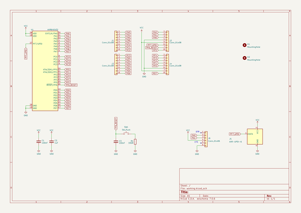

# OOMP Project  
## nakabo  by kiu  
  
oomp key: oomp_projects_flat_kiu_nakabo  
(snippet of original readme)  
  
  
  
- nakabo  
  
Welcome to *nakabo* - a collection of neatly designed breakout boards aimed at simplifying development and experimentation.  
  
Feel free to give me a shoutout [@kiu112](https://twitter.com/kiu112) - I would love to see how my [-nakabo](https://twitter.com/search?q=%2523nakabo) boards are being used in your projects.  
  
- nakabo-avr64*  
  
  
  
* All pins routed out to headers / sockets  
* AVR6 IDC connector (6P 2x03 2.54mm / 100mil) for UPDI programming and debugging  
* Major pin functions documented on front silkscreen  
* 2.54mm / 100mil breadboard compatible spacing  
* Dedicated reset button  
* [FT232RL module](https://www.amazon.de/s?k=FT232RL+module) compatible pin socket for easy serial interfacing  
  
Disclaimer: These are not plug and play development boards - you need an UPDI compatible programmer to use them. There is no protection (e.g. reverse polarity), handle with care.  
  
-- nakabo-avr64da32  
  
*nakabo-avr64da32* is a break-out board for the [AVR64DA32](https://www.microchip.com/en-us/product/AVR64DA32) microcontroller.  
  
(Hint: stencil is identical to *nakabo-avr64ea32*)  
  
-- nakabo-avr64db32  
  
*nakabo-avr64db32* is a break-out board for the [AVR64D  
  full source readme at [readme_src.md](readme_src.md)  
  
source repo at: [https://github.com/kiu/nakabo](https://github.com/kiu/nakabo)  
## Board  
  
  
## Schematic  
  
  
  
[schematic pdf](working_schematic.pdf)  
## Images  
