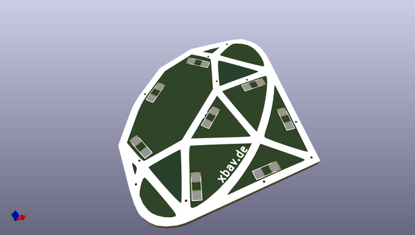
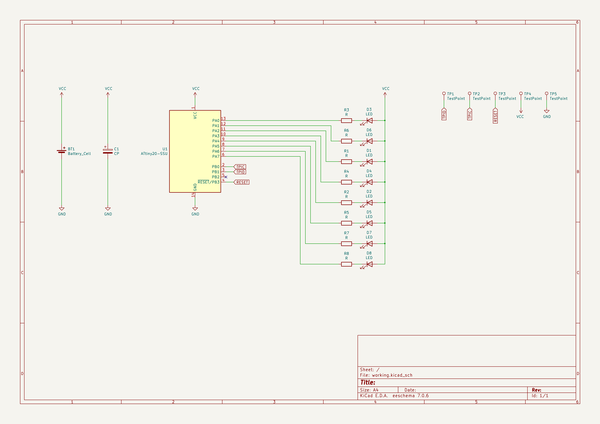

# OOMP Project  
## rubylife  by kiu  
  
oomp key: oomp_projects_flat_kiu_rubylife  
(snippet of original readme)  
  
- rubylife  
Show the world your ruby affection and live the [-BadgeLife](https://twitter.com/search?q=%23badgelife)!  
  
  
  
- What does it do?  
Besides being a stylish ruby pin, it can blink a few animations :)  
  
- What do I need?  
All you need is soldering gear (iron, tin, tweezers). Everything else is in the kit.  
  
-- I don't know how to solder!  
It's easier than it looks, but a bit of help to kickstart your hardware adventure doesn't hurt. Ask your colleagues or friends for help. Or seek help in a [hackerspace](https://hackaday.io/hackerspaces) near you, they will love to teach you the ropes!  
  
-- Anything I need to know before I start?  
Be aware that all parts - except for the resistors - have a polarity. Their orientation on the board is important.  
  
Checkout this [reference](https://github.com/kiu/rubylife/raw/master/media/rubylife_polarity.jpg)!  
  
-- What is in the kit?  
  
| Amount | Item |  
| ------ | ---- |  
| 1 | Printed circuit board |  
| 1 | Pre-programmed microcontroller |  
| 8 | Red LED |  
| 8 | Resistors |  
| 1 | Capacitor |  
| 1 | Battery Holder |  
| 1 | Battery |  
| 1 | Mounting pin |  
| 1 | Glue dot |  
  
A more detailed description can be found in the [Bill-Of-Materials](https://github.com/kiu/rubylife/raw/master/bom.pdf)  
  
- I want to write my own software  
Easy, but be aware that you need C skills to proceed :/  
  
1. Setup an ATTiny development environment, e.g. [Atmel Studio](https://www.microchip.co  
  full source readme at [readme_src.md](readme_src.md)  
  
source repo at: [https://github.com/kiu/rubylife](https://github.com/kiu/rubylife)  
## Board  
  
  
## Schematic  
  
  
  
[schematic pdf](working_schematic.pdf)  
## Images  
