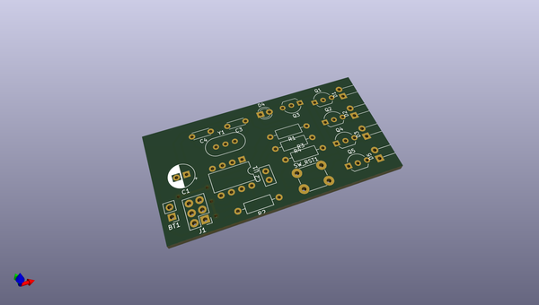
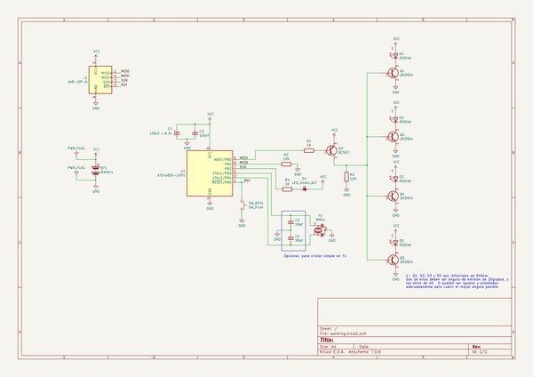

# OOMP Project  
## TallerElectronica  by LacieUnlam  
  
(snippet of original readme)  
  
- Taller de Electronica  
Prácticas de los alumnos del taller de electrónica  
-Instrucciones  
Colocar el ejercicio 1 dentro del año correspondiente y dentro de la carpeta con el apellido correspondiente. No utilizar ramas.  
  
  full source readme at [readme_src.md](readme_src.md)  
  
source repo at: [https://github.com/LacieUnlam/TallerElectronica](https://github.com/LacieUnlam/TallerElectronica)  
## Board  
  
  
## Schematic  
  
  
  
[schematic pdf](working_schematic.pdf)  
## Images  
