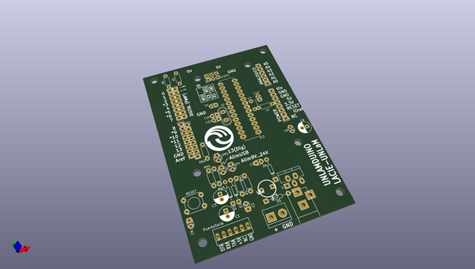

# OOMP Project  
## UNLaM-duino  by LacieUnlam  
  
(snippet of original readme)  
  
- UNLaM-duino  
Clon Arduino desarrollado en la UNLaM con KiCad, simple faz y pensado para fabricación casera.  
  
  
  
  
  
  
  full source readme at [readme_src.md](readme_src.md)  
  
source repo at: [https://github.com/LacieUnlam/UNLaM-duino](https://github.com/LacieUnlam/UNLaM-duino)  
## Board  
  
  
## Schematic  
  
  
  
[schematic pdf](working_schematic.pdf)  
## Images  
