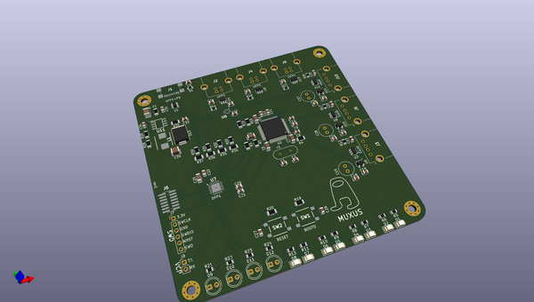
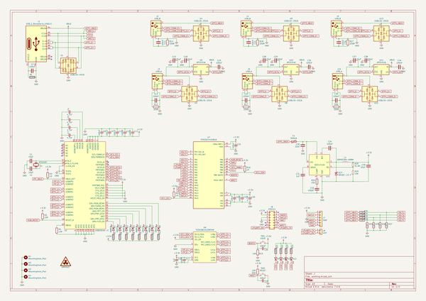

# OOMP Project  
## MUXUS  by leptun  
  
(snippet of original readme)  
  
- MUXUS  
This repository contains the MUXUS project, a USB 2.0 switch with 4 inputs (3xB + 1C_PD) and 4 outputs (3xA + STM32)  
  
  
  
  
  
The project is split into multiple logical parts, all interconected on a PCB.  
1. Upstream USB ports  
2. USB mux  
3. USB hub  
4. Downstream USB ports  
5. STM32 microcontroller  
6. USB PD sink  
7. STM32 programming  
8. 3.3V rail Buck converter  
  
-- 1. Upstream USB ports  
There are 4 upstream capable USB ports (UFP1-UFP4): 3x USB-B and 1xUSB-C  
  
The USB-B ports (UFP2-4) are protected by `USBLC6-2SC6` ICs (VBUS, D+/-).  
  
The USB-C port (UFP1) is protected by a `USBLC6-4SC6` IC (VBUS, D+/-, CC1/2).  
  
-- 2. USB mux  
All Upstream facing ports (UFP) are connected to the USB mux IC (`TS3USBCA420RSVR`).  
The mux output is connected to an internal usb bus called IFP (inner facing port).  
Even though this IC is designed to multiplex SBU pins on USB-C ports, its bandwidth is high enough for USB 2.0 signals.  
This IC is connected to the MCU via a 400KHz I2C bus. All control is done via I2C.  
  
-- 3. USB hub  
The IFP bus is split into multiple downstream ports (DFP1-DFP4) using a USB 2.0 HS hub (`USB2504A-JT`).  
The hub has an I2C interface as well and it   
  full source readme at [readme_src.md](readme_src.md)  
  
source repo at: [https://github.com/leptun/MUXUS](https://github.com/leptun/MUXUS)  
## Board  
  
  
## Schematic  
  
  
  
[schematic pdf](working_schematic.pdf)  
## Images  
