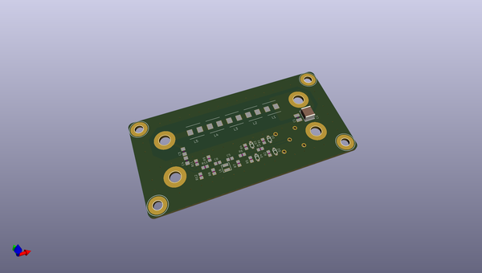

# OOMP Project  
## 5uh-dc-lisn  by LibreSolar  
  
oomp key: oomp_projects_flat_libresolar_5uh_dc_lisn  
(snippet of original readme)  
  
- 5uH-DC-LISN  
5uH DC LISN (-10 dB attenuation)  
  
This LISN enables you to perform basic EMC testing with your DC devices, e.g. power supplies.  
  
The layout (especially the attenuation) is based on Linear Technology DC2130A board design and a [thread in the EEVblog forum](http://www.eevblog.com/forum/projects/5uh-lisn-for-spectrum-analyzer-emcemi-work/msg404662/-msg404662).  
  
Further information on EMC testing can be found in [Würth Application Note ANP005](http://www.we-online.de/web/en/electronic_components/produkte_pb/application_notes/emv_filter_fuer_dc_dc_schaltregler_optimiert.php).  
  
  full source readme at [readme_src.md](readme_src.md)  
  
source repo at: [https://github.com/LibreSolar/5uh-dc-lisn](https://github.com/LibreSolar/5uh-dc-lisn)  
## Board  
  
  
## Schematic  
  
  
  
[schematic pdf](working_schematic.pdf)  
## Images  
