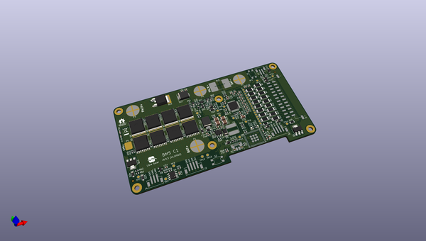
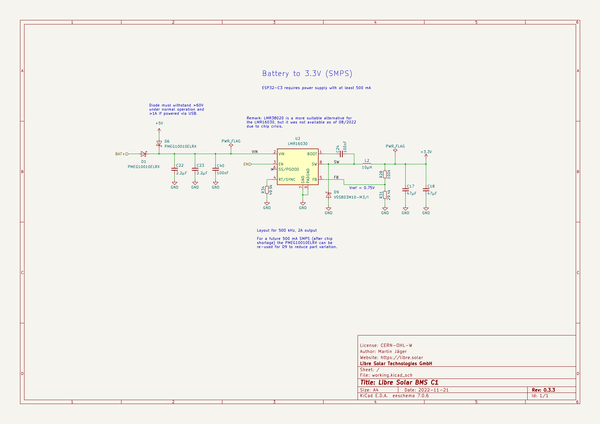
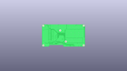
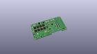
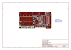
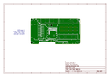
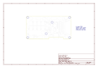
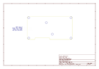
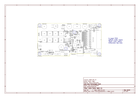

# OOMP Project  
## bms-c1  by LibreSolar  
  
(snippet of original readme)  
  
- Libre Solar BMS C1  
  
 Tested prototype, only minor issues left.  
  
This repository contains the files for ongoing development of the Libre Solar BMS C1.  
  
**Remark:** This BMS was previously named **BMS 16S100 SC**. It was renamed to C1 (with C for compact/centralized) because the maximum current and supported number of cells depend on the parts actually populated on the PCB, so these specs should not be encoded in the PCB name.  
  
The development of this BMS is funded by the [EnAccess foundation](https://enaccess.org).  
  
Schematic: [PDF file](build/bms-c1.pdf)  
  
Bill of Materials: [CSV file](build/bms-c1_bom.csv) or [interactive HTML BOM](https://libre.solar/bms-c1/bms-c1_ibom.html)  
  
Firmware repository: [LibreSolar/bms-firmware](https://github.com/LibreSolar/bms-firmware)  
  
  
  
User manual: [libre.solar/bms-c1/manual/](https://libre.solar/bms-c1/manual/)  
  
Mechanical CAD file: [bms-c1.FCStd](housing/bms-c1.FCStd)  
  
Mechanical BOM: [bms-c1_bom_mechanical.csv](housing/bms-c1_bom_mechanical.csv)  
  
Heat sink drawings: [10003_BackPlateAsm.pdf](housing/10003_BackPlateAsm.pdf)  
  
Test report: [testing/v0.3](testing/v0.3/README.md)  
  
-- Features  
  
- 3 to 16 Li-ion cells in series  
- Continuous current: 70-100A (depending on used MOSFETs and heat sink)  
- Cell types: LiFePO4, Li-ion NMC and others (customizable)  
- Measurements  
  - Cell voltages  
  - Pack voltage  
  - Pack current  
  - Pack (2  
  full source readme at [readme_src.md](readme_src.md)  
  
source repo at: [https://github.com/LibreSolar/bms-c1](https://github.com/LibreSolar/bms-c1)  
## Board  
  
  
## Schematic  
  
  
  
[schematic pdf](working_schematic.pdf)  
## Images  
  
  
  
  
  
  
  
  
  
  
  
  
  
  
  
  
