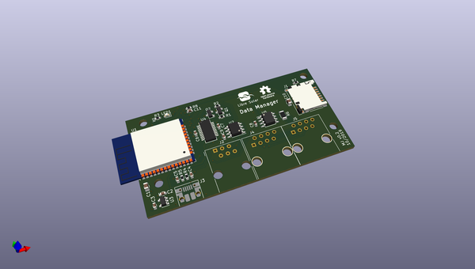

# OOMP Project  
## data-manager  by LibreSolar  
  
oomp key: oomp_projects_flat_libresolar_data_manager  
(snippet of original readme)  
  
- Data Manager for Libre Solar devices  
  
 Prototype built, development and testing ongoing (especially firmware).  
  
  
  
Schematic: [PDF file](data-manager.pdf)  
  
Firmware repository: [LibreSolar/data-manager-firmware](https://github.com/LibreSolar/data-manager-firmware)  
  
-- Features  
  
- ESP32 WROOM board for WiFi and Bluetooth connection  
- USB Micro-B power supply and debug serial  
- microSD card slot  
- LS.one interface (UART serial)  
- LS.bus interface (CAN)  
- Suitable housing: Hammond Mfg. 1591XXAFLBK  
  
  full source readme at [readme_src.md](readme_src.md)  
  
source repo at: [https://github.com/LibreSolar/data-manager](https://github.com/LibreSolar/data-manager)  
## Board  
  
  
## Schematic  
  
  
  
[schematic pdf](working_schematic.pdf)  
## Images  
