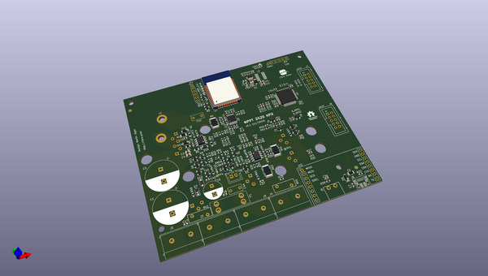
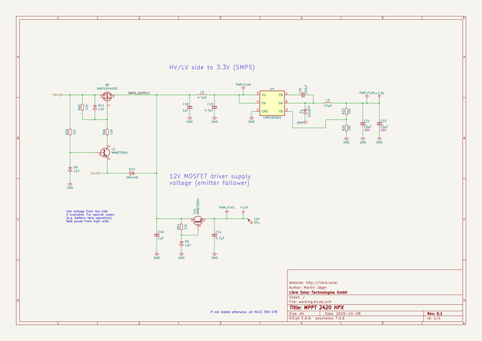

# OOMP Project  
## mppt-2420-hpx  by LibreSolar  
  
(snippet of original readme)  
  
- Libre Solar MPPT 2420 HPX  
  
 First prototype board ordered.  
  
  
  
Schematic: [PDF file](mppt-2420-hpx.pdf) in repository  
  
-- Concept description  
  
  
  
The **battery** port voltage can be 12V or 24V.  
  
The **MPPT** port is connected to the battery via the DC/DC converter. This port is typically used as the solar panel input.  
  
If building a hybrid system, the MPPT port can be used for wind generator input (after rectification) and the solar panel is connected to the **PWM** port. For a pure wind energy system, the PWM port can be used for controlling a dump load.  
  
The **load output** protects the battery from deep-discharge if there is not sufficient power from solar panel or wind turbine. It is switched on the high-side to prevent issues with second GND paths e.g. via USB or audio cables.  
  
-- Features  
  
- MPPT terminal  
    - Max. 80V (using 100V MOSFETs)  
    - DC/DC converter inductor current max. 20A, resulting in approx. 560 W maximum power for 24V systems  
- Battery terminal  
    - 10 V - 32 V (supporting 12 V and 24 V battery systems)  
    - Max. current: 20A  
- High-side load output switch  
    - Max. current: 20A  
- PWM input/output terminal  
    - Max. current: 20A  
- Fast inductor current measurement (sample rate > 300 kHz) to allow implementation of digital DC/DC control algorithms  
-  
  full source readme at [readme_src.md](readme_src.md)  
  
source repo at: [https://github.com/LibreSolar/mppt-2420-hpx](https://github.com/LibreSolar/mppt-2420-hpx)  
## Board  
  
  
## Schematic  
  
  
  
[schematic pdf](working_schematic.pdf)  
## Images  
