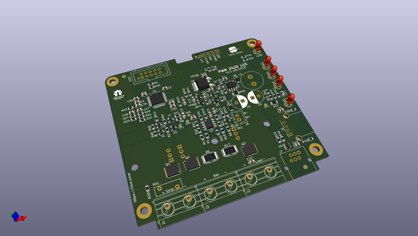
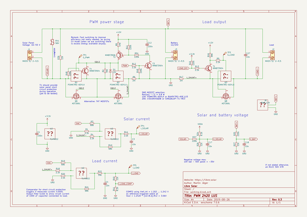

# OOMP Project  
## pwm-2420-lus  by LibreSolar  
  
oomp key: oomp_projects_flat_libresolar_pwm_2420_lus  
(snippet of original readme)  
  
- PWM Solar Charge Controller (10-20A)  
  
 Tested prototype, only minor issues left.  
  
This PWM charge controller is cheaper than the MPPT charge controllers, as it does not contain the internal powerful DC/DC converter necessary for MPPT. The lower production cost and easy manufacturing with larger SMD components makes it ideally suited for solar home systems (SHS) for rural electrification.  
  
The design allows to use either SMD MOSFETs or TO220 THT MOSFETs, which can be easily attached to a heat sink.  
  
  
  
Schematic: [PDF file](pwm-2420-lus.pdf) in repository  
  
Gerber files: [PCB ordering](http://libre.solar/docs/pcb_ordering) documentation  
  
Bill of Materials: [BOM export](http://libre.solar/docs/bom) from KiCAD  
  
Firmware: [Charge Controller Firmware](https://github.com/LibreSolar/charge-controller-firmware) repository  
  
-- Features:  
- 12V/24V battery voltage  
- Up to 20A max. charge current (depending on selected MOSFETs)  
- 55V max. solar input  
- 32bit ARM MCU (STM32L072)  
- Expandable via Olimex Universal Extension Connector (UEXT) featuring  
   I2C, Serial and SPI interface (e.g. used for display, WIFI communication, etc.)  
- USB charging (single port)  
- Low-side load switching  
  
-- Built-in protection  
- Overvoltage  
- Undervoltage  
- Overcurrent  
- PV short circuit  
- PV reverse polarity (for max. module open circuit voltage of around 40V)  
- Battery reverse  
  full source readme at [readme_src.md](readme_src.md)  
  
source repo at: [https://github.com/LibreSolar/pwm-2420-lus](https://github.com/LibreSolar/pwm-2420-lus)  
## Board  
  
  
## Schematic  
  
  
  
[schematic pdf](working_schematic.pdf)  
## Images  
