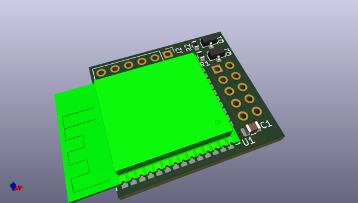

# OOMP Project  
## uext-esp32  by LibreSolar  
  
oomp key: oomp_projects_flat_libresolar_uext_esp32  
(snippet of original readme)  
  
- WiFi/Bluetooth communication board based on ESP32 for UEXT connector  
  
  
  
-- Features  
  
- UEXT connector to communicate with host MCU via UART  
- Separate programming connector  
  
  
  full source readme at [readme_src.md](readme_src.md)  
  
source repo at: [https://github.com/LibreSolar/uext-esp32](https://github.com/LibreSolar/uext-esp32)  
## Board  
  
  
## Schematic  
  
  
  
[schematic pdf](working_schematic.pdf)  
## Images  
