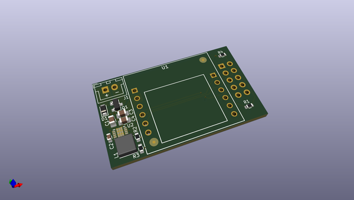

# OOMP Project  
## uext-gsm  by LibreSolar  
  
oomp key: oomp_projects_flat_libresolar_uext_gsm  
(snippet of original readme)  
  
- GSM board based on SIM800L for UEXT connector  
  
-- Features  
  
- Separate power supply from 12V or 5V (GSM board needs 4.2V and 2A)  
- Reverse polarity protection for separate power supply  
- UEXT connector to communicate with host MCU  
  
--- Top side   
  
  
  
--- Bottom side  
  
  
  
  
  full source readme at [readme_src.md](readme_src.md)  
  
source repo at: [https://github.com/LibreSolar/uext-gsm](https://github.com/LibreSolar/uext-gsm)  
## Board  
  
  
## Schematic  
  
  
  
[schematic pdf](working_schematic.pdf)  
## Images  
