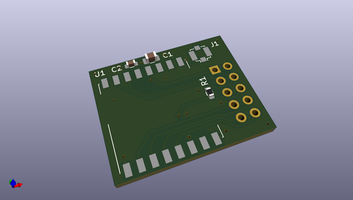

# OOMP Project  
## uext-lora  by LibreSolar  
  
(snippet of original readme)  
  
- LoRa communication board based on HopeRF RFM95 for UEXT connector  
  
Designed with KiCad 5.  
  
-- Features  
  
- UEXT connector to communicate with host MCU  
- Separate antenna connector  
  
--- Image   
  
  
  
  
  
  full source readme at [readme_src.md](readme_src.md)  
  
source repo at: [https://github.com/LibreSolar/uext-lora](https://github.com/LibreSolar/uext-lora)  
## Board  
  
  
## Schematic  
  
  
  
[schematic pdf](working_schematic.pdf)  
## Images  
