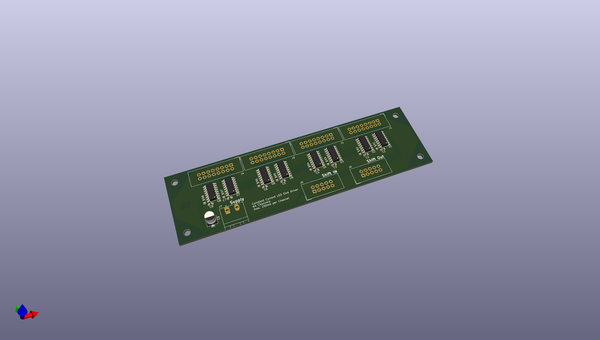
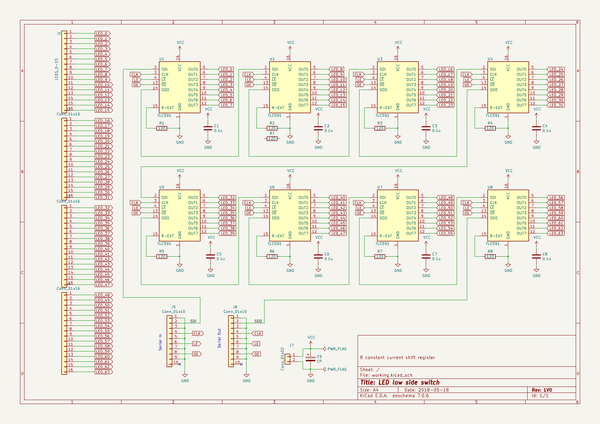

# OOMP Project  
## LED-Cube  by LosNarfos  
  
(snippet of original readme)  
  
- LED-Cube  
RGB led cube with 8x8x8 size.   
  
Testing  
  
http://de.farnell.com/mean-well/lrs-100-5/netzteil-ac-dc-5v-18a/dp/2815972?st=Meanwell  
http://de.farnell.com/infineon/irf7410gtrpbf/mosfet-p-kanal-12v-16a-soic/dp/2725904?st=IRF7410GTRPBF  
http://de.farnell.com/texas-instruments/tlc5916id/led-treiber-linear-16-soic/dp/1755247?st=TLC591  
  full source readme at [readme_src.md](readme_src.md)  
  
source repo at: [https://github.com/LosNarfos/LED-Cube](https://github.com/LosNarfos/LED-Cube)  
## Board  
  
  
## Schematic  
  
  
  
[schematic pdf](working_schematic.pdf)  
## Images  
