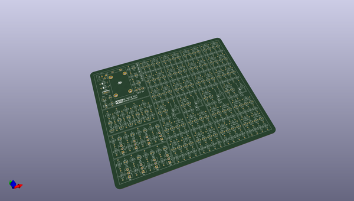

# OOMP Project  
## 4-bit  by macmade  
  
(snippet of original readme)  
  
4-Bit Computer  
==============  
  
  
  
  
    
  
  
  
  
About  
-----  
  
This learning project consists of a 4-bit adder, using NPN transistors.    
Inspiration comes from www.waitingforfriday.com.  
  
The goal is to create a complete project using KiCad: schematics and PCB.    
Components will be ordered from Mouser; PCB will be ordered from OSH Park.  
  
--- Software  
  
Schemas and PCB layouts are created with KiCad:    
http://www.kicad-pcb.org  
  
Bill Of Materials  
-----------------  
  
| Manufacturer            | Part No.             | Details                                                                  | Quantity |  
|-------------------------|----------------------|--------------------------------------------------------------------------|----------|  
| Mean Well               | [GE24I12-  
  full source readme at [readme_src.md](readme_src.md)  
  
source repo at: [https://github.com/macmade/4-bit](https://github.com/macmade/4-bit)  
## Board  
  
  
## Schematic  
  
  
  
[schematic pdf](working_schematic.pdf)  
## Images  
