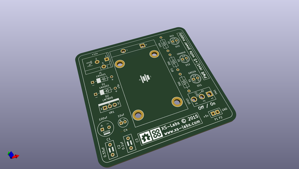

# OOMP Project  
## PWR  by macmade  
  
(snippet of original readme)  
  
PWR  
===  
  
  
  
  
    
  
  
  
  
About  
-----  
  
+5 volt power supply for breadboards using a 12 volt DC wall adapter or a 9 volt battery.  
  
--- Software  
  
Schemas and PCB layouts are created with KiCad:    
http://www.kicad-pcb.org  
  
--- Board  
  
Here's what the board looks like:  
  
  
  
  
Bill Of Materials  
-----------------  
  
| Manufacturer            | Part No.             | Details                                                                  | Quantity |  
|-------------------------|----------------------|--------------------------------------------------------------------------|----------|  
| Mean Well               | [GE24I12-P1J]      
  full source readme at [readme_src.md](readme_src.md)  
  
source repo at: [https://github.com/macmade/PWR](https://github.com/macmade/PWR)  
## Board  
  
  
## Schematic  
  
  
  
[schematic pdf](working_schematic.pdf)  
## Images  
