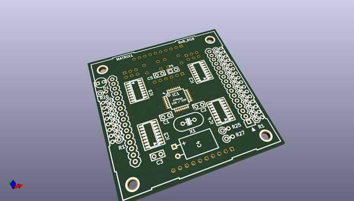
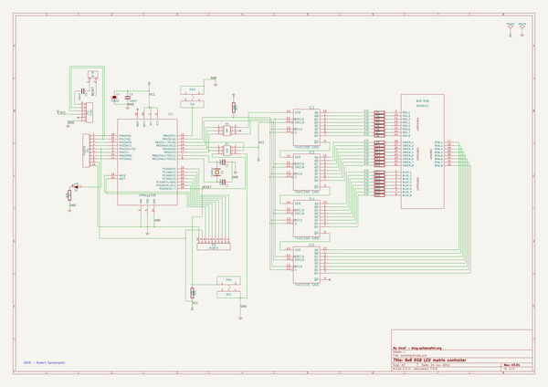

# OOMP Project  
## 8x8_RGB_LED_Matrix_Controller  by madworm  
  
(snippet of original readme)  
  
  
8x8_RGB_LED_Matrix_Controller  
=============================  
  
LAYOUT FILES: 8x8-RGB-LED-Matrix controller using 4x 74HC595 shift registers. CPU: ATmega168/328. Arduino 'compatible'. Runs with code from [V3_x_boards_test](https://github.com/madworm/V3_x_boards_test) repo. KICAD and Gerber files.  
  
  
---  
  
Before having PC-boards made, please make sure you know about your manufacturer's peculiarities!  
Especially drill-sizes and their tolerances may vary too much and give you trouble.  
  
  
  full source readme at [readme_src.md](readme_src.md)  
  
source repo at: [https://github.com/madworm/8x8_RGB_LED_Matrix_Controller](https://github.com/madworm/8x8_RGB_LED_Matrix_Controller)  
## Board  
  
  
## Schematic  
  
  
  
[schematic pdf](working_schematic.pdf)  
## Images  
