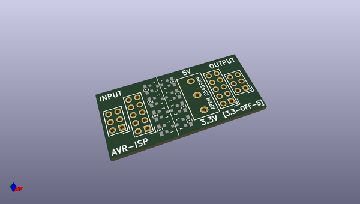
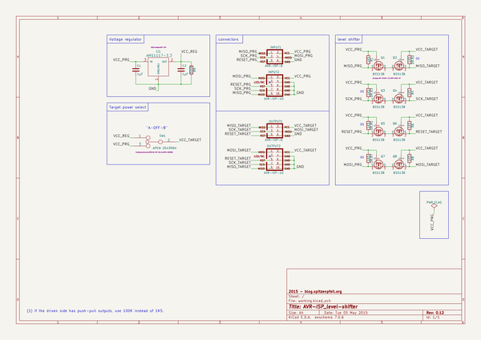

# OOMP Project  
## AVR-ISP_level-shifter  by madworm  
  
(snippet of original readme)  
  
  
AVR-ISP_level-shifter  
=====================  
  
LAYOUT FILES: Bidirectional level-shifter for old 5V-only AVR-ISP programmers  
	      (or for ones that claim to do 3.3V and only offer that on VCC - not on I/O).  
  
  
---  
  
Before having PC-boards made, please make sure you know about your manufacturer's peculiarities!  
Especially drill-sizes and their tolerances may vary too much and give you trouble.  
  
  
  full source readme at [readme_src.md](readme_src.md)  
  
source repo at: [https://github.com/madworm/AVR-ISP_level-shifter](https://github.com/madworm/AVR-ISP_level-shifter)  
## Board  
  
  
## Schematic  
  
  
  
[schematic pdf](working_schematic.pdf)  
## Images  
