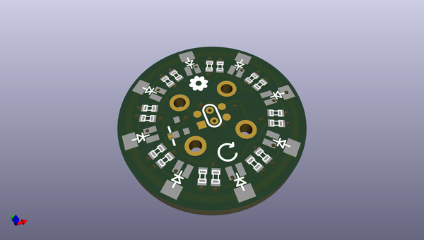
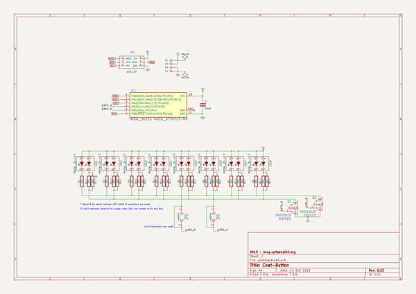

# OOMP Project  
## Coat-Button  by madworm  
  
(snippet of original readme)  
  
  
Coat-Button  
===========  
  
LAYOUT FILES: Sewable blinky button for coats.  
  
Make sure to check all [branches!](https://github.com/madworm/Coat-Button/branches)  
  
  
You will find code for this project in [this](https://github.com/madworm/ATtiny_projects/tree/master/13/Coat-Button) repository.  
  
  
---  
  
Before having PC-boards made, please make sure you know about your manufacturer's peculiarities!  
Especially drill-sizes and their tolerances may vary too much and give you trouble.  
  
  
  full source readme at [readme_src.md](readme_src.md)  
  
source repo at: [https://github.com/madworm/Coat-Button](https://github.com/madworm/Coat-Button)  
## Board  
  
  
## Schematic  
  
  
  
[schematic pdf](working_schematic.pdf)  
## Images  
