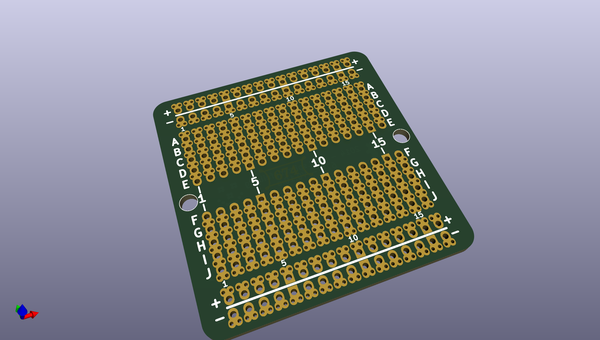

# OOMP Project  
## High-density-proto-board  by madworm  
  
oomp key: oomp_projects_flat_madworm_high_density_proto_board  
(snippet of original readme)  
  
  
High-density-proto-board  
========================  
  
LAYOUT FILES: Bread-board like proto-board with 1.27mm raster (50mil).  
  
  
  
  
---  
  
Before having PC-boards made, please make sure you know about your manufacturer's peculiarities!  
Especially drill-sizes and their tolerances may vary too much and give you trouble.  
  
  
  full source readme at [readme_src.md](readme_src.md)  
  
source repo at: [https://github.com/madworm/High-density-proto-board](https://github.com/madworm/High-density-proto-board)  
## Board  
  
  
## Schematic  
  
  
  
[schematic pdf](working_schematic.pdf)  
## Images  
