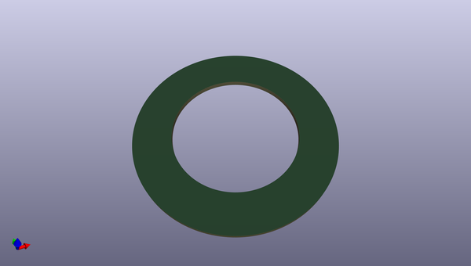
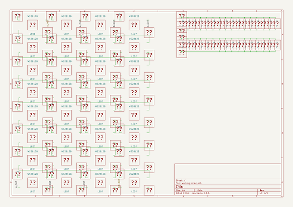

# OOMP Project  
## IKEA-Samtid_mood-light  by madworm  
  
(snippet of original readme)  
  
  
IKEA-Samtid_mood-light  
======================  
  
LAYOUT FILES: Circular extension board for IKEA Samtid lamps (*).  
  
WS2812B-based Arduino compatible RGB ring light.   
  
Remote control with:  
  
* HC-05 bluetooth module (native).  
* ESP8266 with adapter PCB & 3.3V regulator (small adapter).  
  
  
  
  
Hardware releases:   
  
* [V0.27.a](https://github.com/madworm/IKEA-Samtid_mood-light/releases/tag/V0.27.a): basic mood light  
* [Final](https://github.com/madworm/IKEA-Samtid_mood-light/releases/tag/Final): upgraded with Bluetooth/WiFi option  
  
See 'Docs' on master branch for hints/errata!  
  
Firmware [repository](https://github.com/madworm/IKEA-Samtid_mood-light_FW) & Arduino setup files.  
Works with Adafruit [NeoPixel](https://github.com/adafruit/Adafruit_NeoPixel) library.  
  
  
(*) I was told it also works with IKEA Aläng lamps.  
  
  
---  
  
Created with KiCad BZR5093 or later. You need an up-to-date release to open these files!  
  
Before having PC-boards made, please make sure you know about your manufacturer's peculiarities!  
Especially drill-sizes and their tolerances may vary too much and give you trouble.  
  
  
  full source readme at [readme_src.md](readme_src.md)  
  
source repo at: [https://github.com/madworm/IKEA-Samtid_mood-light](https://github.com/madworm/IKEA-Samtid_mood-light)  
## Board  
  
  
## Schematic  
  
  
  
[schematic pdf](working_schematic.pdf)  
## Images  
