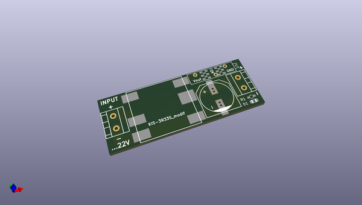
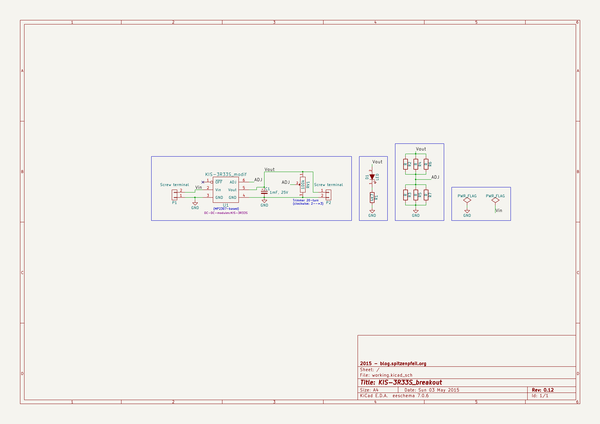

# OOMP Project  
## KIS-3R33S_breakout  by madworm  
  
(snippet of original readme)  
  
  
KIS-3R33S_breakout  
==================  
  
LAYOUT FILES: - see title -  
  
  
---  
  
Before having PC-boards made, please make sure you know about your manufacturer's peculiarities!  
Especially drill-sizes and their tolerances may vary too much and give you trouble.  
  
  
  full source readme at [readme_src.md](readme_src.md)  
  
source repo at: [https://github.com/madworm/KIS-3R33S_breakout](https://github.com/madworm/KIS-3R33S_breakout)  
## Board  
  
  
## Schematic  
  
  
  
[schematic pdf](working_schematic.pdf)  
## Images  
