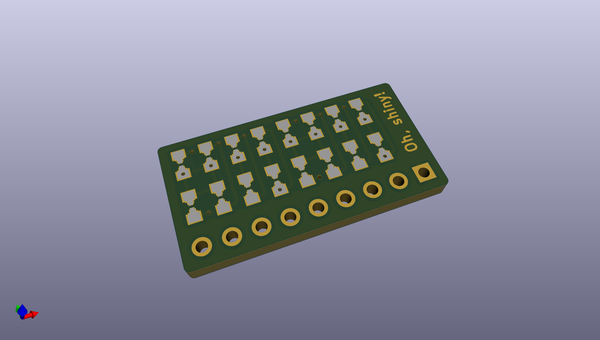
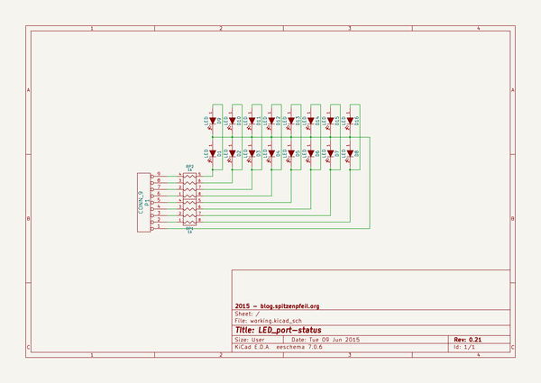

# OOMP Project  
## LED_port-status  by madworm  
  
oomp key: oomp_projects_flat_madworm_led_port_status  
(snippet of original readme)  
  
  
LED_port-status  
===============  
  
LAYOUT FILES: Easily display the status of GPIO lines when using a breadboard.  
  
  
  
  
  
  
  
  
  
  
  
  
  
  
---  
  
Before having PC-boards made, please make sure you know about your manufacturer'  
  full source readme at [readme_src.md](readme_src.md)  
  
source repo at: [https://github.com/madworm/LED_port-status](https://github.com/madworm/LED_port-status)  
## Board  
  
  
## Schematic  
  
  
  
[schematic pdf](working_schematic.pdf)  
## Images  
