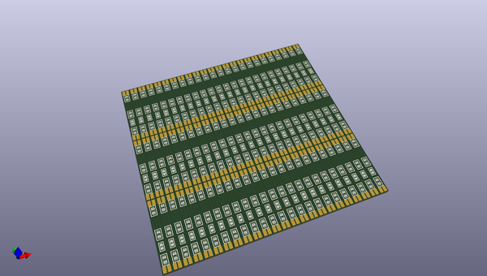
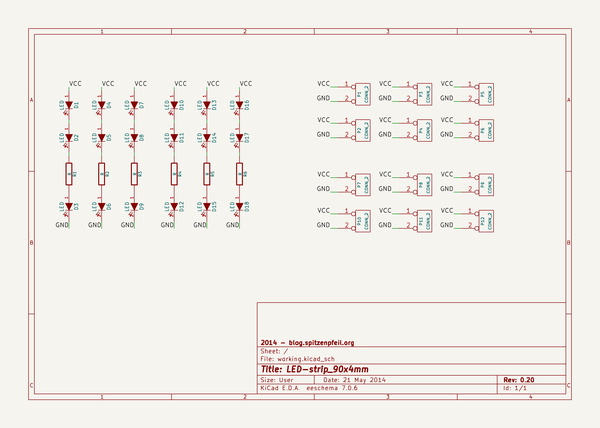

# OOMP Project  
## LED-strip_90x4mm  by madworm  
  
(snippet of original readme)  
  
  
LED-strip_90x4mm  
================  
  
LAYOUT FILES: 90mm x 4mm LED strip with 9x 0805 LEDs + resistors  
  
  
---  
  
Before having PC-boards made, please make sure you know about your manufacturer's peculiarities!  
Especially drill-sizes and their tolerances may vary too much and give you trouble.  
  
  
  full source readme at [readme_src.md](readme_src.md)  
  
source repo at: [https://github.com/madworm/LED-strip_90x4mm](https://github.com/madworm/LED-strip_90x4mm)  
## Board  
  
  
## Schematic  
  
  
  
[schematic pdf](working_schematic.pdf)  
## Images  
