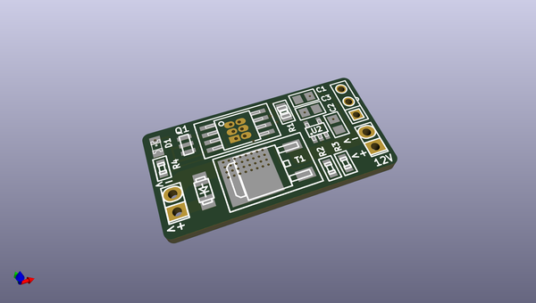
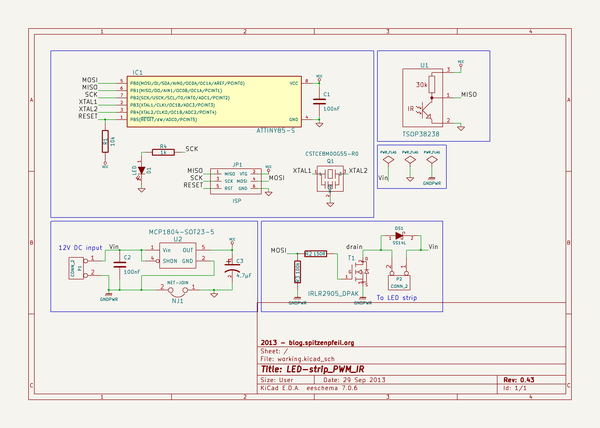

# OOMP Project  
## LED-strip_PWM_IR  by madworm  
  
oomp key: oomp_projects_flat_madworm_led_strip_pwm_ir  
(snippet of original readme)  
  
  
LED-strip_PWM_IR  
================  
  
LAYOUT FILES: Small high-current PWM controller with IR receiver (ATtiny85 based).   
  
  
---  
  
Before having PC-boards made, please make sure you know about your manufacturer's peculiarities!  
Especially drill-sizes and their tolerances may vary too much and give you trouble.  
  
  
  full source readme at [readme_src.md](readme_src.md)  
  
source repo at: [https://github.com/madworm/LED-strip_PWM_IR](https://github.com/madworm/LED-strip_PWM_IR)  
## Board  
  
  
## Schematic  
  
  
  
[schematic pdf](working_schematic.pdf)  
## Images  
