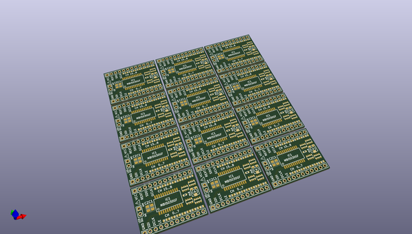
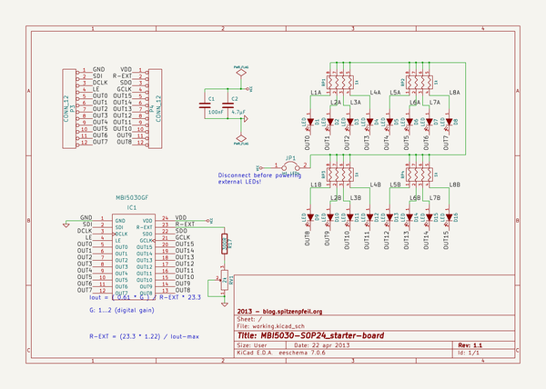

# OOMP Project  
## MBI5030_starter-board  by madworm  
  
oomp key: oomp_projects_flat_madworm_mbi5030_starter_board  
(snippet of original readme)  
  
  
MBI5030_starter-board  
=====================  
  
LAYOUT FILES: Simple breadboard starter board for the MBI5030. Includes 16 SMD LEDs for instant light.   
  
  
  
You will find code for this project in [this](https://github.com/madworm/MBI5030_demo) repository.  
  
---  
  
Before having PC-boards made, please make sure you know about your manufacturer's peculiarities!  
Especially drill-sizes and their tolerances may vary too much and give you trouble.  
  
  
  full source readme at [readme_src.md](readme_src.md)  
  
source repo at: [https://github.com/madworm/MBI5030_starter-board](https://github.com/madworm/MBI5030_starter-board)  
## Board  
  
  
## Schematic  
  
  
  
[schematic pdf](working_schematic.pdf)  
## Images  
