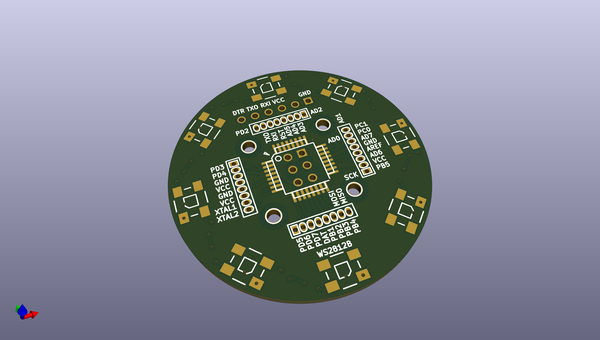
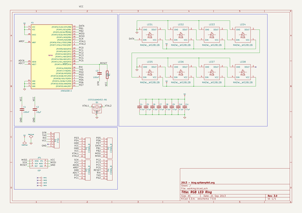

# OOMP Project  
## RGB_LED_TOY  by madworm  
  
(snippet of original readme)  
  
  
RGB_LED_TOY  
===========  
  
LAYOUT FILES: LED ring board with 8 WS2812B RGB LEDs driven by an ATmega168-20AU TQFP-32 7x7 micro controller. KICAD and Gerber files.  
  
You will find code for this project in [this](https://github.com/madworm/rgb_led_toy_test) repository.  
  
  
  
  
---  
  
Before having PC-boards made, please make sure you know about your manufacturer's peculiarities!  
Especially drill-sizes and their tolerances may vary too much and give you trouble.  
  
  
  full source readme at [readme_src.md](readme_src.md)  
  
source repo at: [https://github.com/madworm/RGB_LED_TOY](https://github.com/madworm/RGB_LED_TOY)  
## Board  
  
  
## Schematic  
  
  
  
[schematic pdf](working_schematic.pdf)  
## Images  
