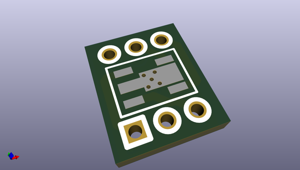
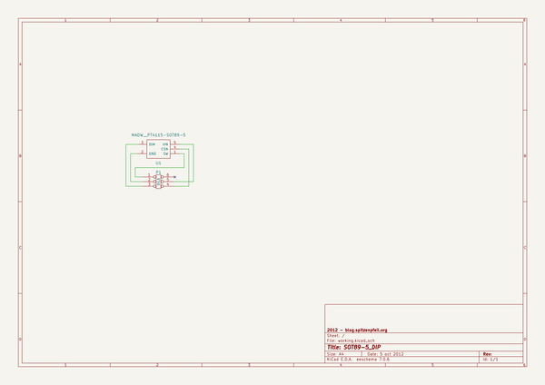

# OOMP Project  
## SOT89-5_DIP  by madworm  
  
oomp key: oomp_projects_flat_madworm_sot89_5_dip  
(snippet of original readme)  
  
  
SOT89-5_DIP  
===========  
  
LAYOUT FILES: SOT89-5 to DIP adapter - e.g. for PT4115 LED driver.  
  
  
---  
  
Before having PC-boards made, please make sure you know about your manufacturer's peculiarities!  
Especially drill-sizes and their tolerances may vary too much and give you trouble.  
  
  
  full source readme at [readme_src.md](readme_src.md)  
  
source repo at: [https://github.com/madworm/SOT89-5_DIP](https://github.com/madworm/SOT89-5_DIP)  
## Board  
  
  
## Schematic  
  
  
  
[schematic pdf](working_schematic.pdf)  
## Images  
