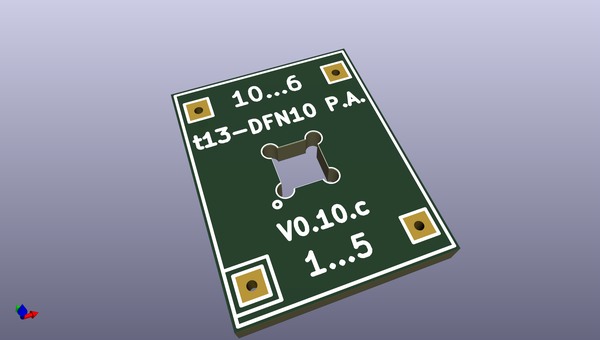
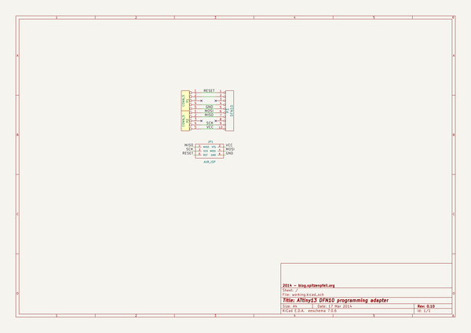

# OOMP Project  
## t13-DFN10-prog-adapter  by madworm  
  
(snippet of original readme)  
  
  
t13-DFN10-prog-adapter  
======================  
  
LAYOUT FILES: jig to help program ATtiny13-MMU (DFN10, 3x3mm, 0.5mm) chips without soldering them down.   
  
  
---  
  
Before having PC-boards made, please make sure you know about your manufacturer's peculiarities!  
Especially drill-sizes and their tolerances may vary too much and give you trouble.  
  
  
  full source readme at [readme_src.md](readme_src.md)  
  
source repo at: [https://github.com/madworm/t13-DFN10-prog-adapter](https://github.com/madworm/t13-DFN10-prog-adapter)  
## Board  
  
  
## Schematic  
  
  
  
[schematic pdf](working_schematic.pdf)  
## Images  
