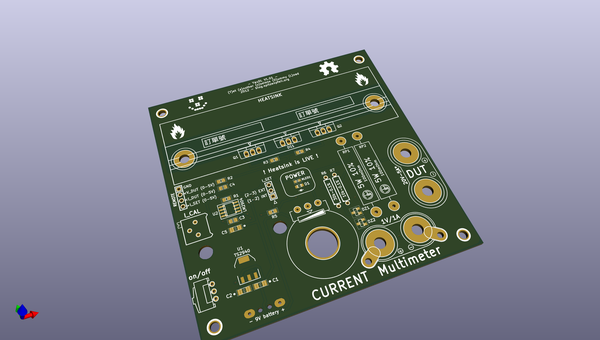
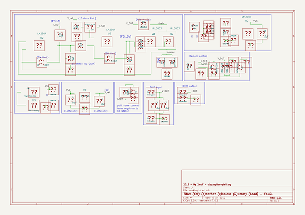

# OOMP Project  
## YauDL  by madworm  
  
oomp key: oomp_projects_flat_madworm_yaudl  
(snippet of original readme)  
  
YauDL  
=====  
  
LAYOUT FILES: (Y)et (a)nother (u)seless (D)ummy (L)oad  
  
  
  
For testing various projects I desire an adjustable constant current sink.  
Nothing fancy, not microcontroller controlled, not 'constant power', maybe  
with a display, maybe just use a DMM for that. BUT I need AMPS!  
I'm shooting for a device that is capable to sink 5A. At least for a limited  
amount of time, a couple of minutes should be enough to see if the DUT  
overheats and/or craps out.  
  
It will be as simple as can be: MOSFET(s), heatsink, sense resistor(s),  
opamp(s), gain control, reference voltage, multi-turn pot to set the  
reference current. It may or may not come with binding posts.  
  
The first opamp will amplify the voltage drop on the mOhm range sense resistor  
to a useful value (1V --> 1A), the second opamp will be wired in the usual  
follower setup driving the MOSFET(s). I don't want to use a 1R sense resistor,  
as this causes the device to need at least 5V for 5A. I'm aiming at something  
lower.  
  
BTW. It is strictly for DC input voltages.  
  
  
---  
  
Before having PC-boards made, please make sure you know about your manufacturer's peculiarities!  
Especially drill-sizes and their tolerances may vary too much and give you trouble.  
  
  
  full source readme at [readme_src.md](readme_src.md)  
  
source repo at: [https://github.com/madworm/YauDL](https://github.com/madworm/YauDL)  
## Board  
  
  
## Schematic  
  
  
  
[schematic pdf](working_schematic.pdf)  
## Images  
