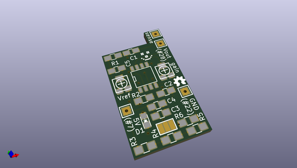
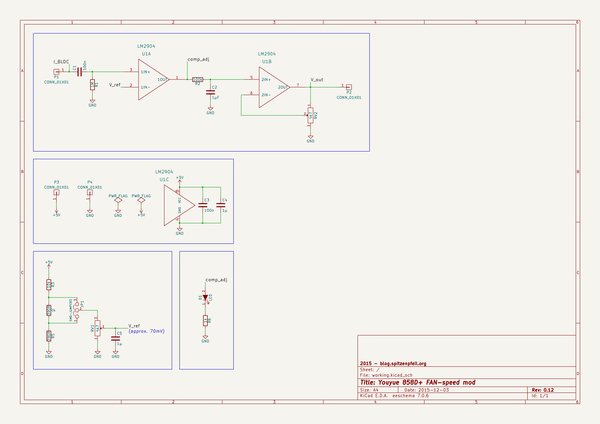

# OOMP Project  
## Youyue-858D-plus-FAN-speed-mod  by madworm  
  
(snippet of original readme)  
  
  
Youyue-858D+ FAN-speed mod:  
===========================  
  
LAYOUT FILES: Proper commutation-based speed detection for the BLDC fan.  
  
  
  
Made to be used on top of this circuit board:  
  
MCU-adapter-board [repository](https://github.com/madworm/Youyue-858D-plus-MCU-adapter)  
  
Firmware [repository](https://github.com/madworm/Youyue-858D-plus)  
  
  
---  
  
Safety information / disclaimer:  
================================  
                                                                                                                                                               
Making any modifications to this device may cause you irreversible physical harm or worse.                                                                     
You do this at your own risk.                                                                                                                                  
                                                                                                                                                               
There is a significant risk of lethal electrical shock, so if you still insist of doing so, make sure to                                                       
ALWAYS UNPLUG THE MAINS CABLE before dismantling the device. Check repeatedly.                                                                                 
                                                                              
  full source readme at [readme_src.md](readme_src.md)  
  
source repo at: [https://github.com/madworm/Youyue-858D-plus-FAN-speed-mod](https://github.com/madworm/Youyue-858D-plus-FAN-speed-mod)  
## Board  
  
  
## Schematic  
  
  
  
[schematic pdf](working_schematic.pdf)  
## Images  
