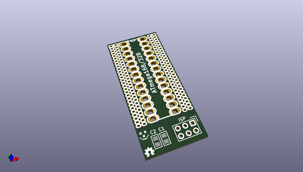
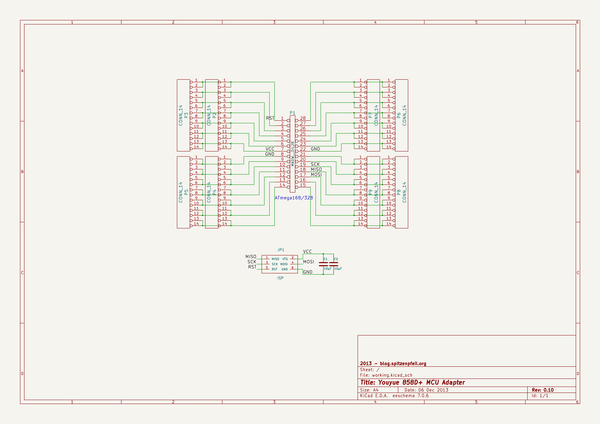

# OOMP Project  
## Youyue-858D-plus-MCU-adapter  by madworm  
  
(snippet of original readme)  
  
  
Youyue-858D+ MCU-adapter:  
=========================  
  
LAYOUT FILES: ATmega168/328 adapter board for the Youyue 858D+.    
  
  
  
The purpose if this little board is to add an ISP header and a convenient way of adding  
more stuff via some TH solder pads.  
  
The old MCU (ATmega8) + socket are removed and replaced with a new DIP28 socket (machined pins).  
These same machined pins go into the bigger holes of the adapter board and form a  
low-profile socket for the new MCU (ATmega168). The adapter board then plugs into  
the socket on the main circuit board.  
  
Firmware [repository](https://github.com/madworm/Youyue-858D-plus).  
  
  
---  
  
Safety information / disclaimer:  
================================  
                                                                                                                                                               
Making any modifications to this device may cause you irreversible physical harm or worse.                                                                     
You do this at your own risk.                                                                                                                                  
                                                                                                                                                               
There is a significant risk of lethal electrical shock, so if you still insist of doing so, make sure to                 
  full source readme at [readme_src.md](readme_src.md)  
  
source repo at: [https://github.com/madworm/Youyue-858D-plus-MCU-adapter](https://github.com/madworm/Youyue-858D-plus-MCU-adapter)  
## Board  
  
  
## Schematic  
  
  
  
[schematic pdf](working_schematic.pdf)  
## Images  
