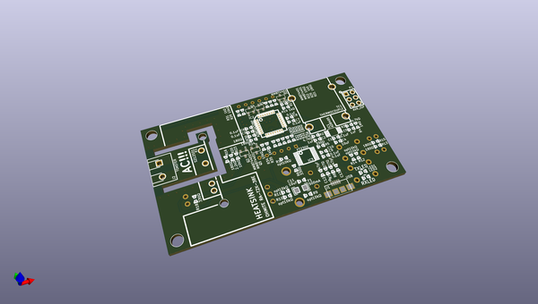
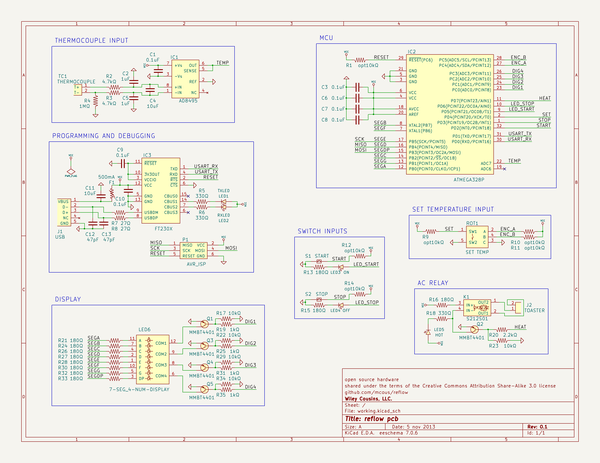

# OOMP Project  
## reflow  by mcous  
  
oomp key: oomp_projects_flat_mcous_reflow  
(snippet of original readme)  
  
- reflow  
  
Heater controller with thermocouple feedback to control any AC heating appliance. It was originally developed to turn a toaster oven into a solder reflow oven, but it'll control anything that runs on AC and gets hot.  
  
-- hardware v0.1  
  
The current board contains an AVR ATMega328P microcontroller, a Sharp S212S01 solid-state relay, and an Analog Devices AD8495 K-type thermocouple amplifier. It has a temperature precision of about 0.5 degrees C and is accurate to about +/- 2 degrees C. It also has start, stop, and mode buttons; a rotary encoder for temperature settings; and a four-digit seven-segment display for showing temperature in C or F.   
  
The schematic and PCB layout files were created in [KiCad](http://www.kicad-pcb.org) and live the in `pcb` directory.  
  
-- firmware v0.1.1  
  
The current firmware has two basic modes: hit and hold. Hit mode takes the temperature up to the set point and then shuts off, while hold mode attempts to hold the temperature at the set-point by turning the heat on when the temperature is below the set point, and off when it's above. This is not PID. It can also display the temperature in either Celsius or Fahrenheit.  
  
The firmware is written in C++ and compiled on OS X using the latest [CrossPack for AVR](http://www.obdev.at/products/crosspack/index.html) and lives in the `firmware` directory. It'll probably compile fine on Linux; no idea about Windows, though.  
  
-- operation  
  
* To switch temperature units, hold the set wheel down (it's als  
  full source readme at [readme_src.md](readme_src.md)  
  
source repo at: [https://github.com/mcous/reflow](https://github.com/mcous/reflow)  
## Board  
  
  
## Schematic  
  
  
  
[schematic pdf](working_schematic.pdf)  
## Images  
