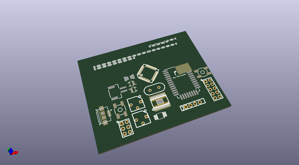
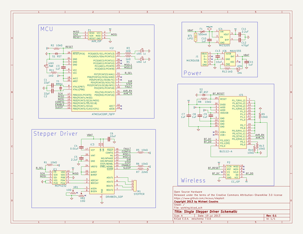

# OOMP Project  
## steptoit  by mcous  
  
oomp key: oomp_projects_flat_mcous_steptoit  
(snippet of original readme)  
  
- Stepper Driver Board  
  
-- Parts to research / use  
* Stepper driver - TI DRV8834  
    * Up to 1/32 microstepping  
    * 1.5 A continuous, 2.2 A peak  
    * Step / direction control  
    * Digikey qty 1: QFN: $2.98, TSOP: $3.53  
* MCU - AVR ATMega328P  
    * Cheap, simple, known  
    * Probably underpowered in the long term  
    * Tops out (apparently) at 16 MHz, and would like to go faster  
* Steppers  
    * check out http://www.mpja.com/  
    * Start small  
  
-- To-do list  
* Finalize(ish) parts list  
* Design stepper control board  
* Order stepper control board  
* Order parts  
* Design stepper testing frame  
    * Three-axis linear movement table?  
    * Three DOF rotational frame?  
* Build stepper frame  
* Assemble control board  
* ???  
* Profit!  
  
  full source readme at [readme_src.md](readme_src.md)  
  
source repo at: [https://github.com/mcous/steptoit](https://github.com/mcous/steptoit)  
## Board  
  
  
## Schematic  
  
  
  
[schematic pdf](working_schematic.pdf)  
## Images  
