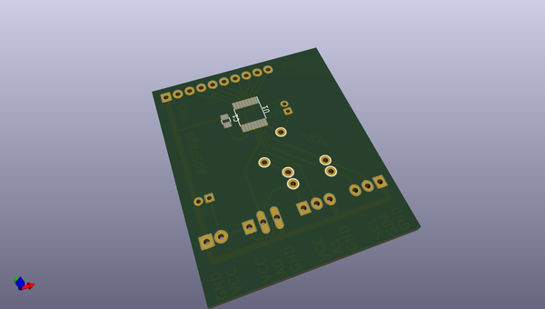
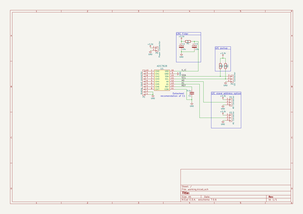

# OOMP Project  
## NAIAD-ADS7828  by MDHSweden  
  
oomp key: oomp_projects_flat_mdhsweden_naiad_ads7828  
(snippet of original readme)  
  
- ADC to I2C test circuit for PDB  
  
This circuit is to test the [ADS7828](http://www.ti.com/lit/ds/symlink/ads7828.pdf)  
  
  
-- ADS7828  
  
>The [ADS7828](http://www.ti.com/lit/ds/symlink/ads7828.pdf) is a single-supply, low-power, 12-bit data  
>acquisition device that features a serial I2C interface and an  
>8-channel multiplexer. The Analog-to-Digital (A/D) converter  
>features a sample-and-hold amplifier and internal,  
>asynchronous clock. The combination of an I2C serial,  
>2-wire interface and micropower consumption makes the  
>ADS7828 ideal for applications requiring the A/D converter to  
>be close to the input source in remote locations and for  
>applications requiring isolation. The ADS7828 is available in  
>a TSSOP-16 package.  
  
-- Test circuit  
  
  
  
--- CRC Filter  
The CRC filter reduces noise for the `V_IC`.  
  
--- I2C pull-up  
> I2C are open drain, which means that they can pull a signal line low, but they are unable to drive it high.  
  
The I2C pull-up is there in case of microcontroller is not having a internal pull-up.  
  
--- I2C slave address option  
`3.3V` or `GND` connected to `A0` and `A1` is required in order to provide a slave address. The 7 bit slave address is `(1, 0, 0, 1, 0, A1, A0)` where `GND` is logic a `0` and `3.3V` is a logic `1`.  
  
  
  
If header pin for `P2` and `P3` is used, an header pin jumper can be used to select slave address.  
  
  
--- Internal reference voltage  
If 3.3V is used then `REF` does not need external vo  
  full source readme at [readme_src.md](readme_src.md)  
  
source repo at: [https://github.com/MDHSweden/NAIAD-ADS7828](https://github.com/MDHSweden/NAIAD-ADS7828)  
## Board  
  
  
## Schematic  
  
  
  
[schematic pdf](working_schematic.pdf)  
## Images  
