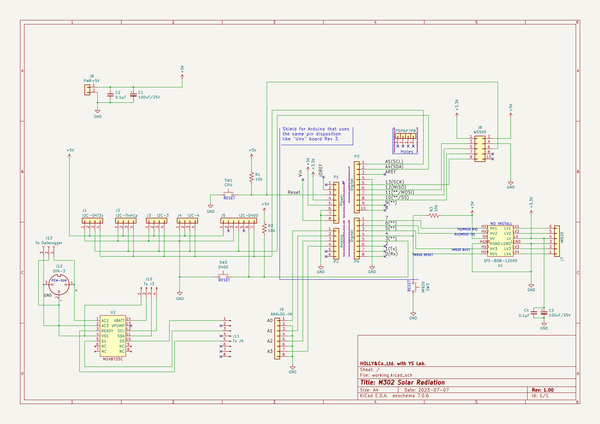

# OOMP Project  
## M302-HX711eva  by mhorimoto  
  
oomp key: oomp_projects_flat_mhorimoto_m302_hx711eva  
(snippet of original readme)  
  
- M302を用いたHX711評価システム  
  
* Arduino UNO  
* M302K  
* HX711  
* ハーフブリッジのロードセル  
  
を用いた重量秤のプログラム  
  
-- Directories  
  
--- main  
  
メインプログラムを収めておく。  
  
  full source readme at [readme_src.md](readme_src.md)  
  
source repo at: [https://github.com/mhorimoto/M302-HX711eva](https://github.com/mhorimoto/M302-HX711eva)  
## Board  
  
  
## Schematic  
  
  
  
[schematic pdf](working_schematic.pdf)  
## Images  
