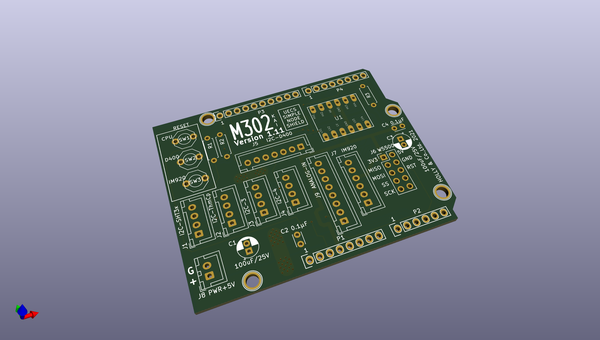
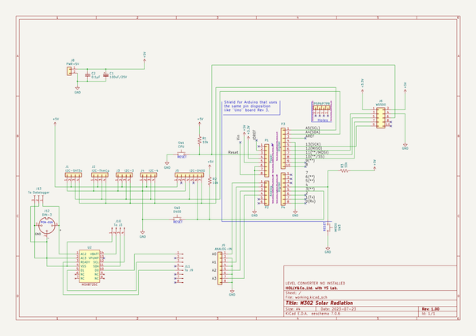

# OOMP Project  
## M302-solar-radiation  by mhorimoto  
  
oomp key: oomp_projects_flat_mhorimoto_m302_solar_radiation  
(snippet of original readme)  
  
- M302を用いた日射量計  
  
* Arduino UNO  
* M302K  
* MSX8725C(marutsu)のSX8725C(A/D Converter)  
* 日射計 SOLOR MINI "PCM-01N"  
  
を用いた日射量観測ノード  
  
-- Directories  
  
--- test  
  
MSX8725を使用するテストプログラムを収めておく。  
  
--- main  
  
メインプログラムを収めておく。  
  
  full source readme at [readme_src.md](readme_src.md)  
  
source repo at: [https://github.com/mhorimoto/M302-solar-radiation](https://github.com/mhorimoto/M302-solar-radiation)  
## Board  
  
  
## Schematic  
  
  
  
[schematic pdf](working_schematic.pdf)  
## Images  
