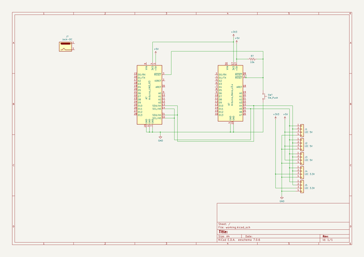

# OOMP Project  
## M321  by mhorimoto  
  
(snippet of original readme)  
  
- M321 UECS簡易観測ノード  
  
実習用にも用いる。  
  
  
  
  full source readme at [readme_src.md](readme_src.md)  
  
source repo at: [https://github.com/mhorimoto/M321](https://github.com/mhorimoto/M321)  
## Board  
  
  
## Schematic  
  
  
  
[schematic pdf](working_schematic.pdf)  
## Images  
