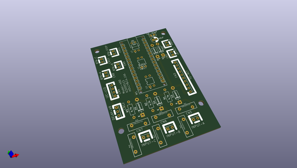

# OOMP Project  
## M400-k2005111  by mhorimoto  
  
oomp key: oomp_projects_flat_mhorimoto_m400_k2005111  
(snippet of original readme)  
  
- 音声切り替え装置 (A26)  
- K2005111  
  
- 要求するHardware  
  
- Arduino Nano V3  
- 8ch Relay module  
- I2C LCD 1602A (Address:0x27)  
  
  
  
  full source readme at [readme_src.md](readme_src.md)  
  
source repo at: [https://github.com/mhorimoto/M400-k2005111](https://github.com/mhorimoto/M400-k2005111)  
## Board  
  
  
## Schematic  
  
  
  
[schematic pdf](working_schematic.pdf)  
## Images  
