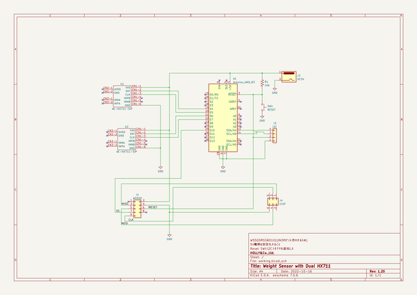

# OOMP Project  
## Q915  by mhorimoto  
  
(snippet of original readme)  
  
- Q915  
- デュアルHX711シールド with UECS  
  
注意点は唯一つ  
  
Ethernet.init(10);  
  
を忘れるな．詳しくは，ググると良い．  
  
2022/10/16  
  
  
  full source readme at [readme_src.md](readme_src.md)  
  
source repo at: [https://github.com/mhorimoto/Q915](https://github.com/mhorimoto/Q915)  
## Board  
  
  
## Schematic  
  
  
  
[schematic pdf](working_schematic.pdf)  
## Images  
