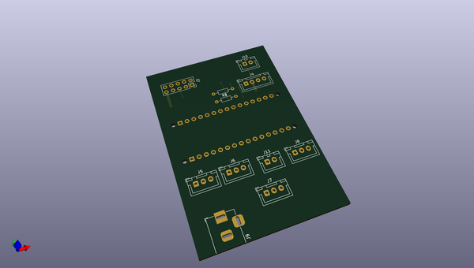
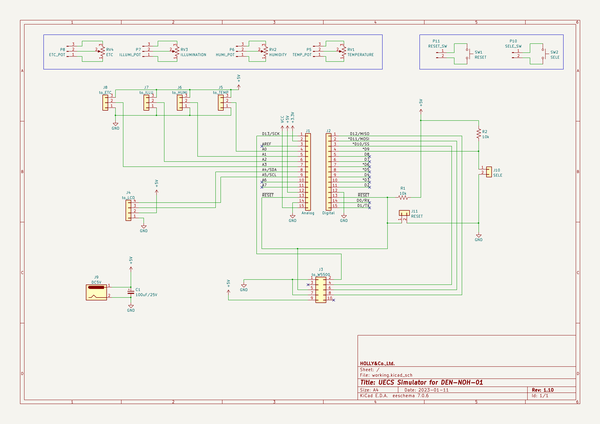

# OOMP Project  
## Q917  by mhorimoto  
  
oomp key: oomp_projects_flat_mhorimoto_q917  
(snippet of original readme)  
  
- Q917  
UECSシミュレータ  
  
4chのアナログデータをUECSパケットにして送信する。  
  
-- H/W諸元  
  
* CPU: Arduino NANO v3  
* LAN: W5500  
* LCD: 16x2  
  
-- UECS諸元  
  
* UECS-ID: 10100C00000C  
* MAC Address: 02:A2:73:0C:xx:xx  
  
-- Low core memory (EEPROM)  
  
UECS-IDとMACアドレスを以下のアドレスに記録する．MSB first，Big endianにて記録す  
る．  
  
|  Address      | Data        |  
|:-------------:|:------------|  
| 00H〜05H      | UECS-ID     |  
| 06H〜0BH      | MAC Address |  
| 0CH〜1FH      | Reserved    |  
| 20H〜7FFFH    | Data        |  
  
  
  full source readme at [readme_src.md](readme_src.md)  
  
source repo at: [https://github.com/mhorimoto/Q917](https://github.com/mhorimoto/Q917)  
## Board  
  
  
## Schematic  
  
  
  
[schematic pdf](working_schematic.pdf)  
## Images  
