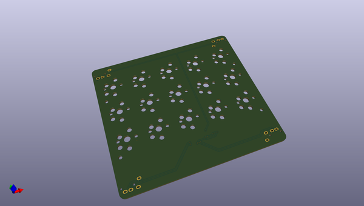
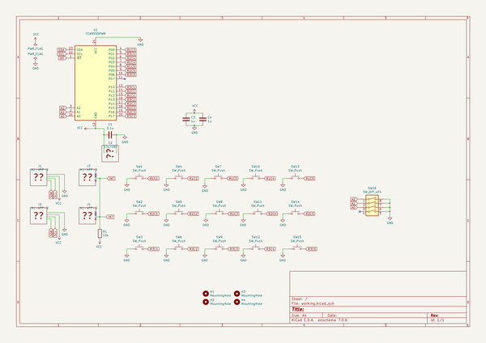

# OOMP Project  
## mithumboard  by mitaroThanken  
  
oomp key: oomp_projects_flat_mitarothanken_mithumboard  
(snippet of original readme)  
  
- mithumboard  
  
市販のキーボードに追加して、親指が活用できるようにする、つもり。WIP。  
  
  full source readme at [readme_src.md](readme_src.md)  
  
source repo at: [https://github.com/mitaroThanken/mithumboard](https://github.com/mitaroThanken/mithumboard)  
## Board  
  
  
## Schematic  
  
  
  
[schematic pdf](working_schematic.pdf)  
## Images  
