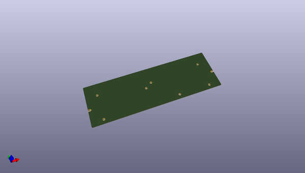
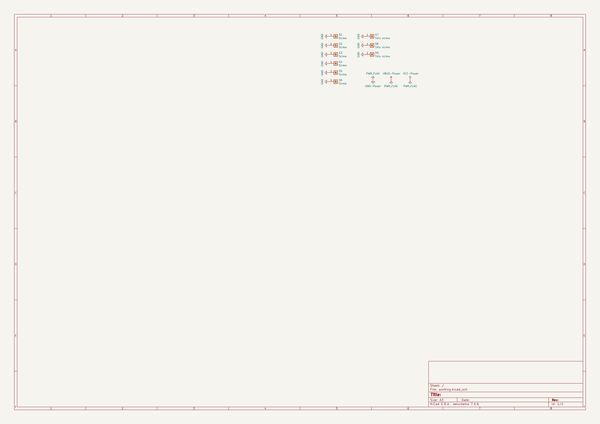

# OOMP Project  
## plain60-c  by mitaroThanken  
  
(snippet of original readme)  
  
- Plain60-C  
  
  
This universal 60% PCB is designed to support as little layouts as possible without limiting usability for most users. The reason I did this is because other PCBs made for this form factor usually have so many supported layouts that it could almost qualify as swiss cheese.  
  
It also features a fuse and an ESD protection chip to protect the MCU and other parts of the PCB.  
  
-- Features  
- QMK Firmware  
- Compatible with most universal 60% cases and HHKB/WKL Tofu by KBDfans  
- USB type-C  
- ESD protection and fuse  
- No LEDs and no underglow  
- Minimal layout support  
- ISP header  
  
-- Supported layouts  
  
  
-- Building  
If you feel like building a few of these PCBs yourself, go to the 'Releases' tab and download the latest gerber files. Order those at your favourite PCB manufacturer, get the components needed (see below) and solder them on! A hot air station is not required but a soldering iron is. Flux is recommended.  
  
-- Opening the project  
To open the files you will need the latest KiCAD nightly version.  
  
-- Bill of materials (BOM)  
Amount is per PCB, multiply as needed.  
  
| LCSC part - | Description   | Value | Package  | Amount |  
| ----------- | ------------- | ----- | -------- | ------:|  
| C296091     | Capacitor     | 22pF  | 0805     | 2      |  
| C128353     | Capacitor     | 0.1uF | 0805     | 4      |  
| C131056     | Capacitor     | 4.7uF | 0805     |   
  full source readme at [readme_src.md](readme_src.md)  
  
source repo at: [https://github.com/mitaroThanken/plain60-c](https://github.com/mitaroThanken/plain60-c)  
## Board  
  
  
## Schematic  
  
  
  
[schematic pdf](working_schematic.pdf)  
## Images  
