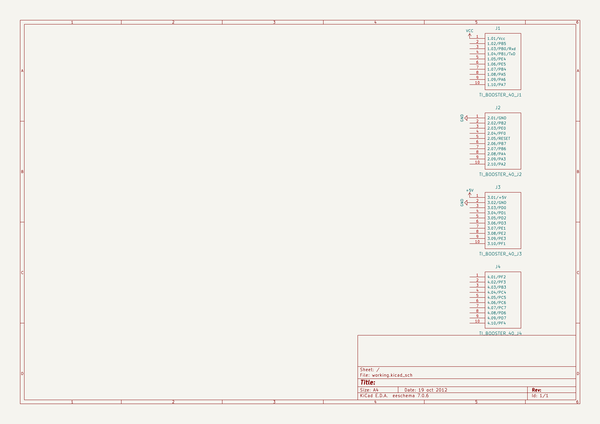

# OOMP Project  
## kicad-templates  by mkleinschmidt  
  
(snippet of original readme)  
  
-- :warning: 301 Moved Permanently  
Location: https://gitlab.com/kicad/libraries/kicad-templates  
  
  full source readme at [readme_src.md](readme_src.md)  
  
source repo at: [https://github.com/mkleinschmidt/kicad-templates](https://github.com/mkleinschmidt/kicad-templates)  
## Board  
  
  
## Schematic  
  
  
  
[schematic pdf](working_schematic.pdf)  
## Images  
