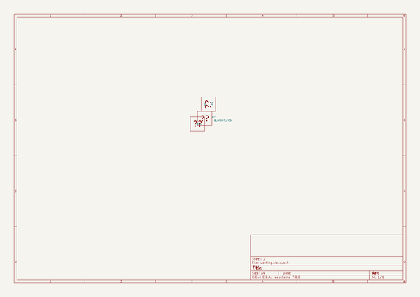

# OOMP Project  
## kicad_projects  by mron  
  
oomp key: oomp_projects_flat_mron_kicad_projects  
(snippet of original readme)  
  
- kicad_project  
  
  full source readme at [readme_src.md](readme_src.md)  
  
source repo at: [https://github.com/mron/kicad_projects](https://github.com/mron/kicad_projects)  
## Board  
  
  
## Schematic  
  
  
  
[schematic pdf](working_schematic.pdf)  
## Images  
