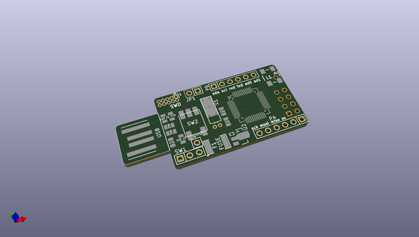
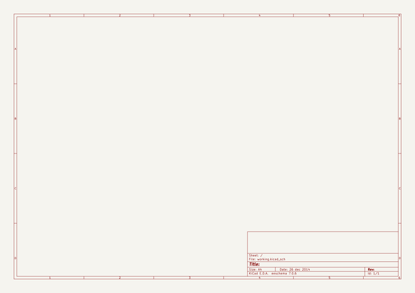

# OOMP Project  
## modular-arm-usb  by myelin  
  
oomp key: oomp_projects_flat_myelin_modular_arm_usb  
(snippet of original readme)  
  
Multi-purpose board with:  
  
- usb type A plug  
- 3v3 ldo (from usb)  
- lpc11u14, swd connector, pullups, caps  
- some broken-out gpio (including uart, i2c, spi)  
- led (ws2812b?)  
- nrf24l01+  
- battery connector (or maybe just a generic power input)  
- fuse  
  full source readme at [readme_src.md](readme_src.md)  
  
source repo at: [https://github.com/myelin/modular-arm-usb](https://github.com/myelin/modular-arm-usb)  
## Board  
  
  
## Schematic  
  
  
  
[schematic pdf](working_schematic.pdf)  
## Images  
