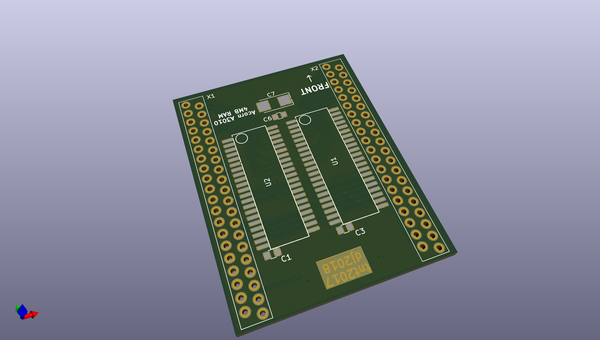
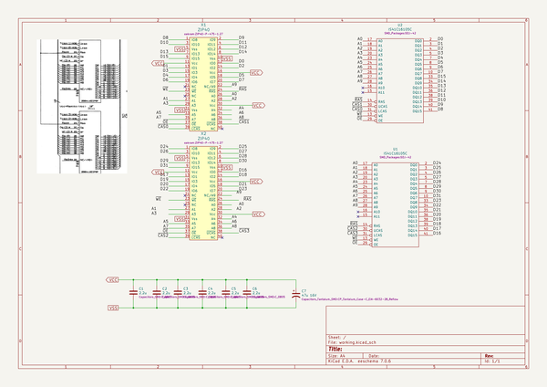

# OOMP Project  
## oakram  by myelin  
  
(snippet of original readme)  
  
- A3010 RAM board  
  
Originally by timtashpulatov, later updated by DanielJ at Stardot.  
  
[Stardot thread](https://stardot.org.uk/forums/viewtopic.php?f=16&t=11214)  
  
Pictures  
--------  
  
  
  
  
  
  full source readme at [readme_src.md](readme_src.md)  
  
source repo at: [https://github.com/myelin/oakram](https://github.com/myelin/oakram)  
## Board  
  
  
## Schematic  
  
  
  
[schematic pdf](working_schematic.pdf)  
## Images  
